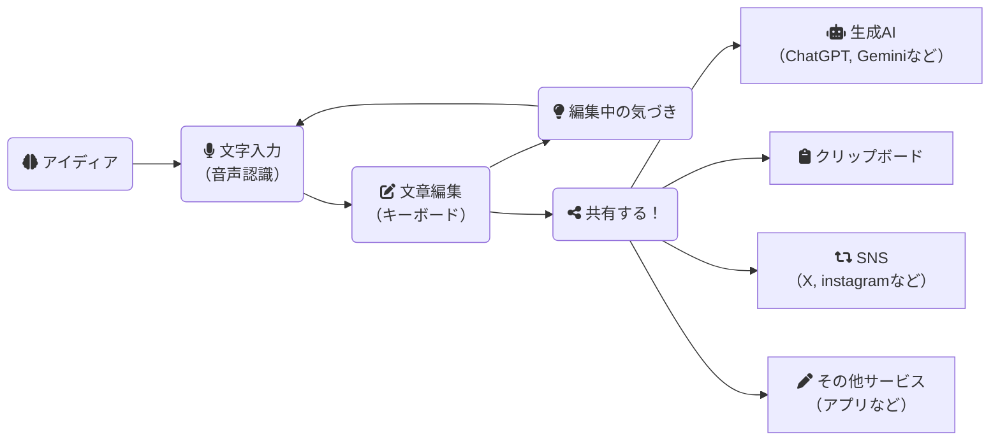

# Koedeam（コエデアム）

無料で使える、声で編む草稿エディタです。  
`/` はLP、`/app/` はPWAエディタです。


## 疑似Issue（Work Item）運用

本リポジトリでは GitHub Issue の代わりに、`docs/roadmaps/product-roadmap.md` を疑似Issue（Work Item）の唯一の正規ソースとして運用します。  
作業前に必ず対象の `WI-ID` を選定し、すべてのPRで `WI-ID` を明記してください。

- Roadmap: `docs/roadmaps/product-roadmap.md`
- すべてのPRは `WI-ID` 必須（例: `Implements: WI-000`）
## コンセプト

- 音声で思考を止めずに草稿化する
- 編集で整えてすぐ共有する
- 本文はサーバー保存しない



## Koedeamの紹介

歩いているときや、ふとした時の思いつきを、特に整理せず前後の脈絡もなく、ひとまずパッとメモしておきたい。  
そんな場面を想定した、音声入力向けの草稿作成簡易エディタが Koedeam（コエデアム）です。

そのまま生成AIに渡して整えることもできますが、次のような場面では入力欄だけの編集機能だと、特にスマホ利用時に扱いづらさが残ります。

- 無秩序なまま渡したくない
- ノイズになる文言やブロックを除去したい
- 優先度や時系列を誤解されないように入れ替えたい

私自身が感じていたストレスを軽減するために、「声で編む」体験を中心に設計しています。  
音声入力した文章を編集し、最終的な場所へ連携・共有していくことを目指しています。

これは文章を完成させるための道具ではなく、  
思考の途中を扱うための道具です。

「アイディア（未満）をひとまず声で発し」「それをざっくり整え」「次につなげていく」。  
この流れを、PC・スマホ・タブレットのブラウザで無料で使える形にしています。

本文データ（本文・履歴・テンプレート・設定）は端末内 `localStorage` に保存します。  
ただし音声認識はブラウザ実装に依存し、外部認識サービス経由になる場合があります。  
Webアプリですが、広告や分析機能は使っていません。ソースを公開しているため、必要に応じて確認できます。

スマホ操作も意識し、カーソル移動・範囲選択・検索置換など、標準入力欄で起きやすい操作の詰まりを緩和できるようにしています。

また、音声入力を継続しながら別の場所を編集できる構成も特徴です（音声入力挿入位置が「文末」のとき）。  
気づいたことを文末に積み上げつつ、既存文を同時に整える使い方を想定しています。PCでは別タブや別アプリを見ながら音声入力を続ける運用も可能です。

共有先プリセットは標準で複数用意しており、任意追加もできます。  
端末間同期は自動ではありませんが、LINE や Discord などをクリップボード代わりに使って連携しやすくしています。

## No Server

本文・履歴・テンプレート・設定は端末内 `localStorage` のみを利用します。

- `koedeam.version`
- `koedeam.currentDraft`
- `koedeam.recentDrafts`
- `koedeam.templates`
- `koedeam.settings`

## 公式UI用語

- `App Header`
- `Status Indicator`
- `Tool Bar`
- `Main Editor`
- `Voice Panel`
- `Edit Panel`
- `Side Bar`
- `Search Panel`
- `Snapshot Panel`
- `Overflow Menu`
- `Update Banner`

## 状態モデル

`UI = Primary x Input x System x Layout`

- `Primary`: `EDIT` / `SEARCH` / `MANAGE` / `CONFIG`
- `Input`: `VOICE_OFF` / `VOICE_APPEND` / `VOICE_LOCKED`
- `System`: `LOCAL` / `SAVING` / `OFFLINE` / `UPDATE_AVAILABLE` / `ERROR`
- `Layout`: `MOBILE` / `TABLET` / `DESKTOP`

## 入力可否ルール

- `VOICE_APPEND` のみ音声とタイピング同時許可
- `VOICE_LOCKED` は `Main Editor` を read-only
- `VOICE_LOCKED` 時は `beforeinput` / `paste` / `keydown` で編集を抑止
- `SEARCH` / `MANAGE` / `CONFIG` では編集優先度を下げ、必要に応じてキーボードを閉じる

## 端末別UI方針

- `MOBILE`: `Main Editor + 1パネル` の排他表示
- `TABLET/DESKTOP`: `Side Bar` 併用可。ただし文書操作優先時は編集抑止
- `Tool Bar`: 1行固定。溢れた機能は `Overflow Menu` へ退避
- `Hamburger Menu`: `Tool Bar` 機能を集約表示（`音声モード` は除外）
- `Search Panel`: `Dialog Overlay` として表示し、起動時に `Side Bar` / `Edit Panel` を閉じる
- `Snapshot Panel`: `Side Bar` の履歴セクションとして表示する
- `Dialog` 表示中は `canOpen()` により `Menu/Search/Document List/Side Bar` の起動を抑止する
- iOS入力ズーム回避: `input/textarea/select` は 16px以上を保証
- Android戻る操作: 開いている `Dialog/Overlay/Side Bar/Edit Panel` を先に閉じてから離脱

## 音声入力

- `SpeechRecognition / webkitSpeechRecognition` 対応時のみ有効
- 非対応時はOSの音声入力キーボードを利用
- Web Speech APIはブラウザ実装により外部認識サービスを使う可能性あり
- `Tool Bar` のマイクボタンで `音声ON/OFF`、音声モードボタンで `カーソル / 文末追記 / コマンド` を切替
- `コマンド` モードでは音声認識結果を本文に挿入せず、辞書一致した編集操作を実行（例: `検索` `切り取り` `コピー` `貼り付け`）
- `停止` はコマンドモード終了ではなく音声入力停止。コマンドモード終了は `終わり` / `中止`
- 辞書仕様は `docs/specs/voice-command-dictionary.md` を参照
- 設定 `音声 > 音声認識` で `continuous` と `lang(auto/ja-JP)` を切替可能

## 共有

- 優先順: `navigator.share` -> `navigator.clipboard.writeText` -> `execCommand('copy')`
- 既定ショートカット: `LINE` / `ChatGPT` / `Gemini` / `Notion` / `Discord`
- 共有ショートカット変数:
- `{text}`: 本文または選択範囲
- `{title}`: 先頭行
- `{prompt}`: `{text}` と同義

## 設定カテゴリ

設定ダイアログは次の6カテゴリに再分類済みです（`設定キー` は従来互換のまま）。

- `音声 (Voice)`
- `表示 (Display)`
- `編集 (Edit)`
- `テンプレ (Template)`
- `共有 (Share)`
- `その他 (Other)`

## ドキュメント管理

- `Document List` で複数ドキュメントを切替
- `Snapshot Panel` は現在ドキュメント単位で履歴を表示/復元
- 既存の古い履歴（`docId` なし）も互換表示
- `App Header` 左上ロゴタップで `Document List` を開く

## Edit Panel

- `Edit Panel` は配置（上/右/下/左）を設定可能
- `Edit Panel` は `Navigation / Edit` の2モードを切替可能
- `Navigation` では `カーソル移動 / 範囲選択` をアコーディオン開閉可能（開閉状態を保存）
- 広い画面では `カーソル` と `範囲選択` を左右分割
- 狭い画面では `カーソル` -> `編集` -> `範囲選択` を縦積み
- `Edit Toolbar` で `Copy/Cut/Paste/Delete/Backspace/句読点/改行/Time/行頭まで削除/行末まで削除/行削除/段落削除` を提供
- `候補しきい値/信頼値なし/放置時/Undo履歴数` は `設定 > 編集` で調整する
- `MOBILE` で `Edit Panel` 操作中はエディタへフォーカスしない（ソフトウェアキーボード干渉を抑制）

## Help導線

- `Help` から次へ直接遷移可能
- LP（`/`）
- エディタ（`/app/`）
- PWAインストール操作
- GitHubリポジトリ（`https://github.com/donayama/Koedeam`）

## PWA導線

### iOS
1. Safariで `/app/` を開く
2. 共有メニュー
3. 「ホーム画面に追加」

### Android
1. Chromeで `/app/` を開く
2. メニュー
3. 「アプリをインストール」または「ホーム画面に追加」

## 更新方式（B方式）

- `app/version.json` を `no-store` 取得して差分判定
- 差分時は `Update Banner` を表示
- 更新押下で `skipWaiting` -> `controllerchange` -> `reload`
- リリース時は `version.json` と `sw.js` のキャッシュ版を必ず更新

## データ初期化 / 強制リロード

- 設定の「その他」タブから実行
- 初期化: `localStorage` の下書き/履歴/テンプレ/設定をリセット
- 強制リロード: Service Worker解除 + Cache削除 + 再読み込み
- Telemetry: 音声認識セッションの検証ログをJSON出力/コピー可能

## ローカル開発

```bash
python -m http.server 8000
```

`http://localhost:8000/` を開いて確認します。

### 非実機チェック（Playwright / Python）

実機でしか完全再現できない項目のうち、次をローカルで疑似確認できます。

- キーボード表示時の下部UI退避（`--kb-offset` 反映）
- 強制リロード前提（Service Worker API / Cache API 利用可否）

```bash
python scripts/local_ui_checks.py --url http://localhost:8000/app/
```

### Replay deterministic チェック（Playwright / Python）

`quiet_01` fixture を `ReplayVoiceEngine` で `realtime/fast` 再生し、出力一致とトレース保存を確認します。

```bash
python scripts/playwright_replay_checks.py --url http://localhost:8000/app/
```

## 検証チェックリスト

1. `MOBILE` 幅で `Tool Bar` が2段化しない
2. `MOBILE` で `Edit Panel` と `Side Bar` が同時展開しない
3. `VOICE_LOCKED` 時に編集入力が反映されない
4. `Dialog` 表示中に `Menu/Search/Document List/Side Bar` を新規起動できない（`canOpen`）
5. `SEARCH` 表示時に `Side Bar` が閉じ、`Edit Panel` が同時展開しない
6. IME変換中にショートカットが誤発火しない
7. `Update Banner` が `version.json` 差分で表示される
8. iOSで入力タップ時に自動ズームしない

